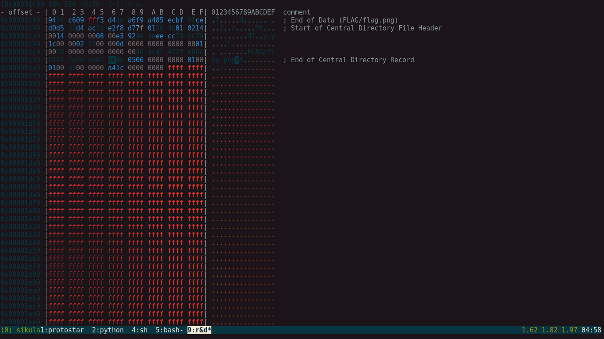

### Repair

**Points: 50**


---
#### Introduction
In this challenge we are given a zip file called `FLAG.zip`, but there is a problem... We can't actually unzip it. Hmm... wonder why that is :)


Lets begin by examining the file, using the `file` command in Linux.  
```bash
$ file FLAG.zip

FLAG.zip: data
```

This should immediately raise a red-flag, `file` can't determine the file type :(

Ok, lets try unzipping it anyway, maybe we may get some useful information (error messages, for example).

```bash
$ unzip FLAG.zip

file #1:  bad zipfile offset (local header sig):  0
```

If you're familiar with the zip structure, this might mean something to you, but since I had no idea, I decided to find out what this could possibly mean. After a few minutes, I stumbled upon [this article](https://users.cs.jmu.edu/buchhofp/forensics/formats/pkzip.html)


Specifically the diagram of interest is this one:

**Local File Headers**

Ok, so lets open this zip in a hex editor, and try to figure out whats wrong.  My hex editor of choice is the builtin hex editor of `radare2`, but feel free to pick your own.


I marked the sections with some comments, to better indicate where the beginning and end of sections are.



Hmmm, interesting, the values which should contain the Signature values `0x504b0304` are `0x00000000`!!!

So, all we have to do now is to add the correct Signature, and we should be good to go!


Now, if we do a `file FLAG.zip` we should get this output.

```bash
FLAG.zip: Zip archive data, at least v2.0 to extract
```

And if we attempt to unzip it:


Now, just open up `FLAG/flag.png`

