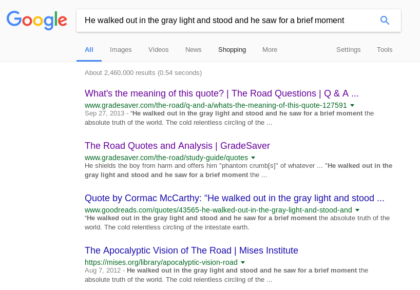

### Tag

We begin by downloading the file the `tag.gz` file.  Running the `file` command shows that it is a `pcap` file.  Great! So lets open it up in Wireshark.


The first think we notice, is a `GET` request for the image `tag_your_it.jpg`.  We can see the response in frame 171.


**The `GET` Request for the image**


**The Response**


Maybe these images have something to do with the challenge.  Lets extract them for analysis. Using, `wireshark` we can export these HTTP Objects.


We can see that there is another file a 7zip comrpessed archive file called `flag.7z` (you could also see this by analyzing the pcap file more, frame 298).


Hmmm.. We need a password to decrypt it.  What could this password be? My initial though was to investigate the two images `tag_your_it.jpg` and `no_scoped.jpg`.  Maybe they contain some `exif` data or the password is in the image someplace.  That proved to be a dead end. This means that our password must be someplace in the pcap file.  We just need to find it.

Taking another look at the pcap, we can see some traffic towards the end, packet `310 - 317`, and if we follow the TCP stream we get something interesting.


A very long base64 encoded string.  Using `Python` we can decode this text (once you decode the original hex string, you will be left with a string which is essentially a hex string which we can decode with Python too).

```python
#!/usrb/bin/env python

data = b'NDg2NTIwNzc2MTZjNmI2NTY0MjA2Zjc1NzQyMDY5NmUyMDc0Njg2NTIwNjc3MjYxNzkyMDZjNjk2NzY4NzQyMDYxNmU2NDIwNzM3NDZmNmY2NDIwNjE2ZTY0MjA2ODY1MjA3MzYxNzcyMDY2NmY3MjIwNjEyMDYyNzI2OTY1NjYyMDZkNmY2ZDY1NmU3NDIwNzQ2ODY1MjA2MTYyNzM2ZjZjNzU3NDY1MjA3NDcyNzU3NDY4MjA2ZjY2MjA3NDY4NjUyMDc3NmY3MjZjNjQyZTIwNTQ2ODY1MjA2MzZmNmM2NDIwNzI2NTZjNjU2ZTc0NmM2NTczNzMyMDYzNjk3MjYzNmM2OTZlNjcyMDZmNjYyMDc0Njg2NTIwNjk2ZTc0NjU3Mzc0NjE3NDY1MjA2NTYxNzI3NDY4MmUyMDQ0NjE3MjZiNmU2NTczNzMyMDY5NmQ3MDZjNjE2MzYxNjI2YzY1MmUyMDU0Njg2NTIwNjI2YzY5NmU2NDIwNjQ2ZjY3NzMyMDZmNjYyMDc0Njg2NTIwNzM3NTZlMjA2OTZlMjA3NDY4NjU2OTcyMjA3Mjc1NmU2ZTY5NmU2NzJlMjA1NDY4NjUyMDYzNzI3NTczNjg2OTZlNjcyMDYyNmM2MTYzNmIyMDc2NjE2Mzc1NzU2ZDIwNmY2NjIwNzQ2ODY1MjA3NTZlNjk3NjY1NzI3MzY1MmUyMDQxNmU2NDIwNzM2ZjZkNjU3NzY4NjU3MjY1MjA3NDc3NmYyMDY4NzU2ZTc0NjU2NDIwNjE2ZTY5NmQ2MTZjNzMyMDc0NzI2NTZkNjI2YzY5NmU2NzIwNmM2OTZiNjUyMDY3NzI2Zjc1NmU2NDJkNjY2Zjc4NjU3MzIwNjk2ZTIwNzQ2ODY1Njk3MjIwNjM2Zjc2NjU3MjJlMjA0MjZmNzI3MjZmNzc2NTY0MjA3NDY5NmQ2NTIwNjE2ZTY0MjA2MjZmNzI3MjZmNzc2NTY0MjA3NzZmNzI2YzY0MjA2MTZlNjQyMDYyNmY3MjcyNmY3NzY1NjQyMDY1Nzk2NTczMjA3NzY5NzQ2ODIwNzc2ODY5NjM2ODIwNzQ2ZjIwNzM2ZjcyNzI2Zjc3MjA2OTc0MmU='
print(data.decode('base64').decode('hex'))
```

Running the Python script gives us an interesting result, which seems to be a quote or excerpt from some writing.


Performing a quick Google search gives us the novel ["The Road"](https://en.wikipedia.org/wiki/The_Road) by Cormac McCarthy.



Hmm.. So what could be the password?  Maybe the name of the novel?

After trying a few different variations("The Road", "TheRoad", "theroad", etc), entering "the road" seemed to do the trick ;)


And finally, catting the `flag.txt` file:
```bash
$ cat flag.txt

sun{phUn_1n_7h3_c0MPl373_l4ck_0f_5UN}
```
